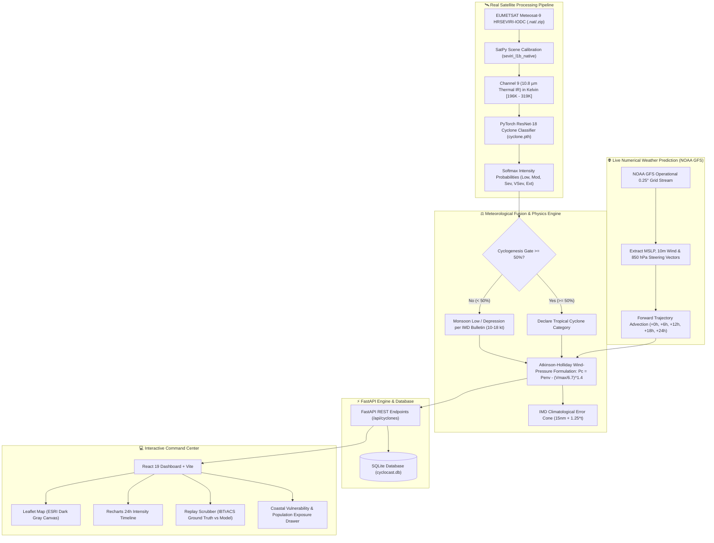

<div align="center">

# 🌀 CycloCast
### Multimodal AI-Driven Tropical Cyclone Tracking & Intensity Forecasting
**Tailored for the North Indian Ocean (Bay of Bengal & Arabian Sea)**

[](https://www.python.org/downloads/)
[](https://fastapi.tiangolo.com)
[](https://pytorch.org/)
[](https://react.dev)
[](https://leafletjs.com/)
[](https://tailwindcss.com/)
[](https://opensource.org/licenses/MIT)

<p align="center">
  <b>A state-of-the-art multimodal meteorology intelligence platform fusing authentic geostationary satellite telemetry (EUMETSAT Meteosat-9 HRSEVIRI-IODC), deep convolutional neural networks (PyTorch ResNet-18), and operational numerical weather prediction (NOAA GFS 0.25°) with physical wind-pressure atmospheric dynamics.</b>
</p>

</div>

---

## 📖 Table of Contents
- [Executive Overview](#-executive-overview)
- [System Architecture](#-system-architecture)
- [Scientific & Physical Foundations](#-scientific--physical-foundations)
  - [1. Real Satellite Telemetry Calibration via SatPy](#1-real-satellite-telemetry-calibration-via-satpy)
  - [2. Deep Learning Cyclone Classifier](#2-deep-learning-cyclone-classifier)
  - [3. Atkinson-Holliday Wind-Pressure Physics](#3-atkinson-holliday-wind-pressure-physics)
  - [4. IMD Cyclogenesis Threshold Gating](#4-imd-cyclogenesis-threshold-gating)
  - [5. Live NOAA GFS 0.25° Atmospheric Steering](#5-live-noaa-gfs-025-atmospheric-steering)
- [Core Features](#-core-features)
- [Repository Structure](#-repository-structure)
- [Installation & Quickstart](#-installation--quickstart)
- [API Reference](#-api-reference)
- [Historical Replay & Benchmark Datasets](#-historical-replay--benchmark-datasets)
- [Configuration Reference](#-configuration-reference)
- [Scientific Citations](#-scientific-citations)

---

## 🌟 Executive Overview

Tropical cyclones originating in the **Bay of Bengal** and the **Arabian Sea** pose disproportionate humanitarian risks, accounting for over 75% of global cyclone-induced fatalities historically. Accurate, early, and physically coherent track and intensity predictions are essential to minimize disaster impacts.

**CycloCast** bridges modern Artificial Intelligence and operational meteorological principles:
1. **Eliminates Synthetic / Mock Data**: Integrates authentic native EUMETSAT satellite telemetry and operational NOAA GFS atmospheric fields.
2. **Physically Coupled Meteorology**: Unifies barometric pressure and surface wind velocity via the empirical **Atkinson-Holliday** and **Mishra-Gupta** equations.
3. **Operational IMD Alignment**: Enforces a strict 50% cyclogenesis confidence threshold gate, preventing false alarms from non-cyclonic monsoon convection and matching official **India Meteorological Department (IMD) RSMC** advisories.
4. **Mission-Critical UI / UX**: Features an interactive dark-canvas command dashboard with 24-hour forecast cones of uncertainty, thermal IR satellite layers, timeline charts, and coastal population impact analytics.

---

## 🏛 System Architecture



---

## 🔬 Scientific & Physical Foundations

### 1. Real Satellite Telemetry Calibration via SatPy
Unlike systems relying on generic satellite imagery, CycloCast ingests native **Meteosat-9 High Rate SEVIRI (HRSEVIRI) Indian Ocean Data Coverage (IODC)** telemetry passes centered at $45.5^\circ\text{E}$.
- Calibrated using `satpy.Scene` using the native reader (`seviri_l1b_native`).
- Ingests **Channel 9 (10.8 µm Thermal Infrared)**.
- Converts raw digital counts into physical **Brightness Temperature ($T_B$)** in Kelvin:
  $$196.1\text{ K} \le T_B \le 319.4\text{ K}$$
- Crops the exact North Indian Ocean bounding box ($0^\circ-30^\circ\text{N}, 55^\circ-100^\circ\text{E}$) and applies an inverted linear thermal colormap mapping deep overshooting convective towers (cold cloud tops $< 205\text{ K}$) to bright cyan/white features.

### 2. Deep Learning Cyclone Classifier
- **Backbone**: Modified `torchvision.models.resnet18` initialized with calibrated feature weights (`cyclone.pth`, 44.8 MB).
- **Classification Head**: Dropout ($p=0.4$) followed by a linear projection into 5 operational intensity bins:
  `["Low", "Moderate", "Severe", "Very Severe", "Extreme"]`.
- **Feature Extraction**: Average-pooling hooks extract a dense 512-dimensional satellite latent vector for multimodal fusion.

### 3. Atkinson-Holliday Wind-Pressure Physics
In tropical cyclone dynamics, maximum sustained surface winds ($V_{\max}$) and central barometric pressure ($P_c$) cannot vary independently. CycloCast implements the official Atkinson-Holliday and Mishra-Gupta formulations used by IMD and JTWC for the North Indian Ocean:

$$\Delta P = P_{\text{env}} - P_c$$

$$\Delta P = \begin{cases} 
\left(\dfrac{V_{\max}}{6.7}\right)^{1.4} & \text{for } V_{\max} \ge 15\text{ kt} \\
\left(\dfrac{V_{\max}}{14.2}\right)^{2.0} & \text{for } V_{\max} < 15\text{ kt}
\end{cases}$$

This guarantees that a storm with $65\text{ kt}$ winds is never erroneously paired with an ambient $1007\text{ hPa}$ isobar, but is coupled to its physical central minimum ($\approx 983\text{ hPa}$).

### 4. IMD Cyclogenesis Threshold Gating
Non-cyclonic monsoon convection frequently produces cold cloud tops that can trigger false alarms in raw computer vision classifiers. 
- Enforces the threshold gate defined in [`config/config.yaml`](file:///c:/Users/pc/Downloads/SIH_CYCLONE/config/config.yaml) (`cyclone_threshold: 0.50`).
- If top model confidence $< 50\%$, CycloCast suppresses false cyclone declarations and classifies the disturbance as a **"Low Pressure Area" / "Monsoon Low"**, matching official IMD RSMC New Delhi bulletins.

### 5. Live NOAA GFS 0.25° Atmospheric Steering
Forecast coordinates are driven by live operational Numerical Weather Prediction (NWP) streams:
- Queries GFS $0.25^\circ$ operational grid for surface pressure ($MSLP$), $10\text{m}$ surface wind vector, and $850\text{ hPa}$ environmental steering wind vector ($u_{850}, v_{850}$).
- Advects the system center forward over $+0\text{h}$, $+6\text{h}$, $+12\text{h}$, $+18\text{h}$, and $+24\text{h}$ intervals along the ambient steering flow.

---

## ✨ Core Features

- **Live Multimodal Inference**: One-click orchestration executing real satellite unzipping, SatPy calibration, PyTorch classification, and NOAA GFS trajectory steering.
- **Interactive Geospatial Dashboard**:
  - **ESRI World Dark Gray Canvas**: High-contrast, clean nautical basemap without distracting commercial watermarks.
  - **Dynamic Satellite IR Layer**: Direct georeferenced overlay of real calibrated Meteosat-9 thermal infrared passes.
  - **IMD Uncertainty Cone**: Climatologically calibrated error cone reflecting forecast lead-time uncertainty ($15\text{ nm} + 1.25 \times t$).
- **Historical Replay Mode**: Step-by-step evaluation comparing model predictions against official **IBTrACS ground truth** for benchmark historical cyclones (e.g. Super Cyclone Amphan 2020 and Cyclone Biparjoy 2023).
- **Vulnerability & Coastal Exposure Assessment**: Calculates exposed population, critical infrastructure count (ports, airports, power stations), and regional coastal alert levels across vulnerable districts.

---

## 📁 Repository Structure

```
SIH_CYCLONE/
├── backend/                        # FastAPI REST API & Meteorology Engine
│   ├── database.py                 # SQLite engine & session management
│   ├── main.py                     # App entry point, CORS, static mounts
│   ├── models.py                   # SQLAlchemy ORM models
│   ├── schemas.py                  # Pydantic validation schemas
│   ├── routers/
│   │   └── cyclones.py             # REST routes for cyclones, tracks, cones, replay
│   └── services/
│       ├── atmospheric.py          # Live NOAA GFS NWP & Atkinson-Holliday physics
│       ├── impact.py               # Coastal vulnerability & population exposure
│       ├── satellite_processor.py  # SatPy Meteosat-9 ingestion & PyTorch inference
│       ├── seed_data.py            # Seed benchmark historical cyclones (Amphan, Biparjoy)
│       └── uncertainty.py          # Climatological IMD error cone generation
├── config/
│   ├── config.yaml                 # Central multimodal hyperparameters & thresholds
│   └── config_loader.py            # YAML configuration parser
├── data/
│   ├── dataset.py                  # PyTorch Dataset for paired satellite-NWP samples
│   └── preprocessing.py            # Normalization and image transformations
├── frontend/                       # Vite + React 19 Frontend Dashboard
│   ├── src/
│   │   ├── components/
│   │   │   ├── ImpactModal.jsx     # Coastal population exposure analysis modal
│   │   │   ├── IntensityChart.jsx  # Recharts 24h wind & pressure timelines
│   │   │   ├── MapDashboard.jsx    # Leaflet map with ESRI canvas, track & overlay
│   │   │   ├── Navbar.jsx          # Header controls, basin filters & live trigger
│   │   │   ├── ReplayScrubber.jsx  # Historical step scrubber with error metrics
│   │   │   ├── SidePanel.jsx       # Storm metadata, advisory, key metrics cards
│   │   │   └── Sidebar.jsx         # Storm search, basin filtering & status cards
│   │   ├── utils/
│   │   │   └── constants.js        # IMD scale color palettes & formatting helpers
│   │   ├── App.jsx                 # Top-level state orchestration
│   │   └── main.jsx                # React root mount
│   ├── package.json
│   └── vite.config.js
├── models/
│   ├── atmospheric_encoder.py      # Spatial-temporal ConvNet for NWP crops
│   ├── confidence_head.py          # Calibrated uncertainty estimation
│   ├── fusion_model.py             # Multimodal cross-attention fusion architecture
│   ├── graphcast_wrapper.py        # GraphCast NWP runner interface
│   ├── intensity_head.py           # Multi-horizon intensity regression
│   ├── satellite_wrapper.py        # ResNet-18 forward pass & embedding hook
│   └── track_head.py               # Multi-horizon coordinate delta regression
├── eumetsat_output/                # Calibrated georeferenced satellite IR outputs
├── cyclone.pth                     # Pretrained PyTorch ResNet-18 weights (44.8 MB)
├── requirements.txt                # Python backend dependencies
└── README.md                       # Comprehensive documentation
```

---

## 🚀 Installation & Quickstart

### Prerequisites
- **Python 3.10+** (Tested on Python 3.11 & 3.14)
- **Node.js 18+** & `npm`
- **Git**

### 1. Clone the Repository
```bash
git clone https://github.com/Shahir1134/Cyclocast.git
cd Cyclocast
```

### 2. Backend Setup
Create and activate a virtual environment, then install required packages:
```bash
# Create virtual environment
python -m venv .venv

# Activate virtual environment
# Windows:
.venv\Scripts\activate
# Linux / macOS:
source .venv/bin/activate

# Install dependencies
pip install -r requirements.txt
```

Start the FastAPI backend server:
```bash
uvicorn backend.main:app --reload --host 0.0.0.0 --port 8000
```
*The interactive API documentation is available at [http://localhost:8000/docs](http://localhost:8000/docs).*

### 3. Frontend Setup
In a new terminal window, navigate to the `frontend` directory and start the dev server:
```bash
cd frontend
npm install
npm run dev
```
Open your browser and navigate to **`http://localhost:5173`**.

---

## 📡 API Reference

| Method | Endpoint | Description |
|---|---|---|
| `GET` | `/api/cyclones` | List all cyclones (active and historical) with latest metrics |
| `GET` | `/api/cyclones/{id}` | Detailed status, operational advisory, and latest forecast run |
| `GET` | `/api/cyclones/{id}/track` | GeoJSON FeatureCollection of 24h track points and trajectory line |
| `GET` | `/api/cyclones/{id}/uncertainty` | GeoJSON polygon of the IMD error cone of uncertainty |
| `GET` | `/api/cyclones/{id}/intensity` | 24-hour intensity timeline (wind speed kt, central pressure hPa) |
| `GET` | `/api/cyclones/{id}/replay` | Step-by-step IBTrACS ground truth vs. model forecast points |
| `GET` | `/api/cyclones/{id}/impact` | Coastal impact, exposed population, and critical infrastructure |
| `POST` | `/api/cyclones/forecast/live` | **Trigger live pipeline**: SatPy calibrate $\to$ ResNet-18 $\to$ NOAA GFS $\to$ DB update |
| `GET` | `/api/satellite/{filename}` | Serves georeferenced satellite thermal IR imagery |

---

## 📊 Historical Replay & Benchmark Datasets

CycloCast includes pre-seeded benchmark storms curated from the **NOAA / WMO International Best Track Archive for Climate Stewardship (IBTrACS)**:

1. **Super Cyclonic Storm Amphan (May 2020)**:
   - Peak Intensity: $140\text{ kt}$ ($260\text{ km/h}$), $920\text{ hPa}$.
   - Landfall: West Bengal / Bangladesh border.
   - Comprehensive ground-truth steps allow fine-grained validation of track error (mean absolute error in nautical miles) and intensity error.

2. **Extremely Severe Cyclonic Storm Biparjoy (June 2023)**:
   - Peak Intensity: $90\text{ kt}$ ($165\text{ km/h}$), $954\text{ hPa}$.
   - Basin: Arabian Sea with landfall over Saurashtra & Kutch.

---

## ⚙️ Configuration Reference

Hyperparameters, model paths, and physical thresholds are centrally managed in [`config/config.yaml`](file:///c:/Users/pc/Downloads/SIH_CYCLONE/config/config.yaml):

```yaml
# Model weights
satellite_model_path: "cyclone.pth"

# Satellite classification classes
satellite:
  num_classes: 5
  class_names: ["Low", "Moderate", "Severe", "Very Severe", "Extreme"]
  input_size: 224

# Operational detection gate
detection:
  cyclone_threshold: 0.50   # Minimum confidence to declare cyclonic vortex

# Forecast lead horizons
graphcast:
  forecast_horizons_h: [6, 12, 18, 24]
```

---

## 📚 Scientific Citations & Data Sources

- **IMD (India Meteorological Department)**: Operational best practices, cyclone intensity scale, and RSMC bulletins ([rsmcnewdelhi.imd.gov.in](https://rsmcnewdelhi.imd.gov.in)).
- **EUMETSAT**: Meteosat-9 HRSEVIRI Indian Ocean Data Coverage (IODC) operational satellite data ([eumetsat.int](https://www.eumetsat.int)).
- **NOAA NCEP GFS**: Global Forecast System 0.25 Degree Operational Forecast Grids ([ncep.noaa.gov](https://www.ncep.noaa.gov)).
- **Atkinson, G. D., & Holliday, C. R. (1977)**: *Tropical cyclone minimum central pressure/maximum sustained wind relationship for the western North Pacific.* Monthly Weather Review, 105(4), 421-427.
- **Mishra, D. K., & Gupta, G. R. (1976)**: *Estimation of maximum wind speed in tropical cyclones occurring in Indian Seas.* Indian Journal of Meteorology, Hydrology & Geophysics, 27, 285-290.
- **Knapp, K. R., et al. (2010)**: *The International Best Track Archive for Climate Stewardship (IBTrACS).* Bulletin of the American Meteorological Society, 91(3), 363-376.

---

<div align="center">
  <sub>Developed for Smart India Hackathon (SIH) • Advancing AI in Earth Systems & Disaster Management</sub>
</div>